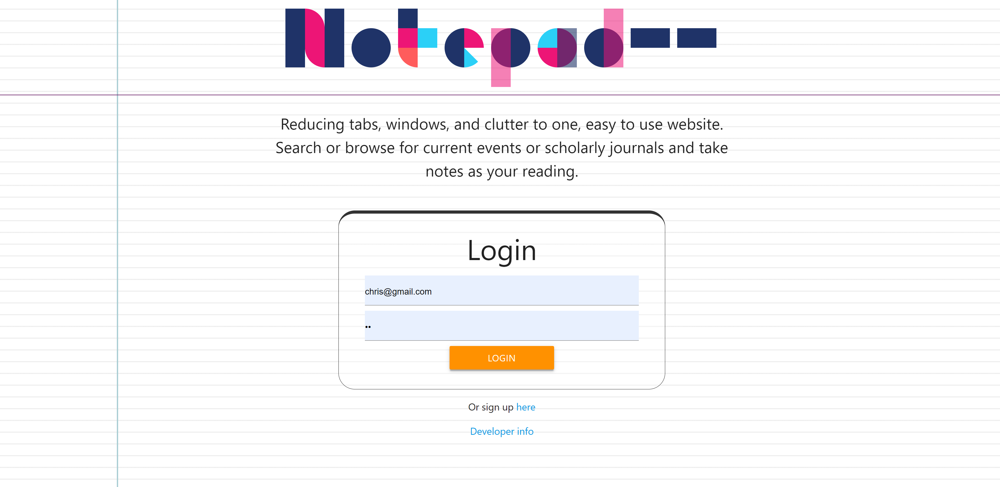
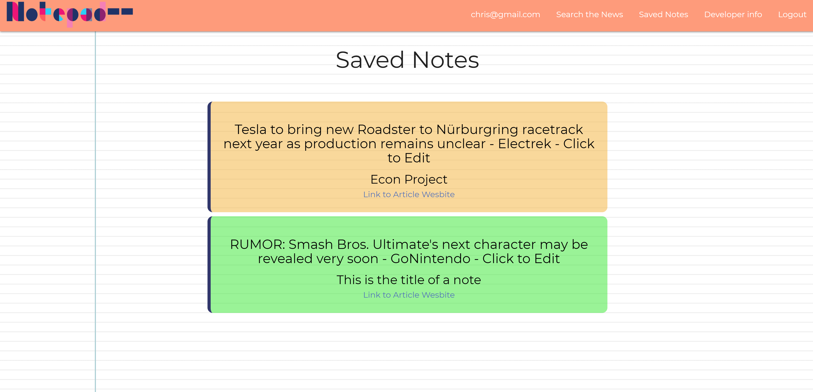
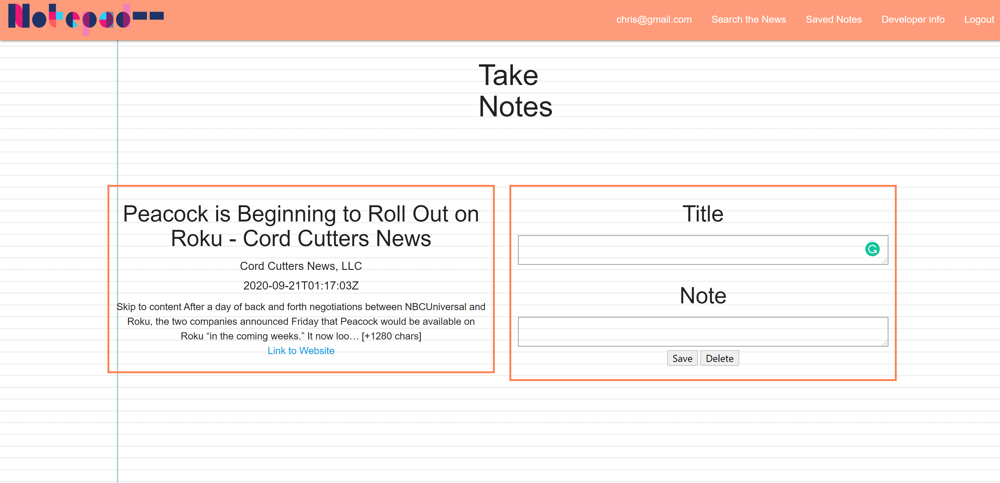
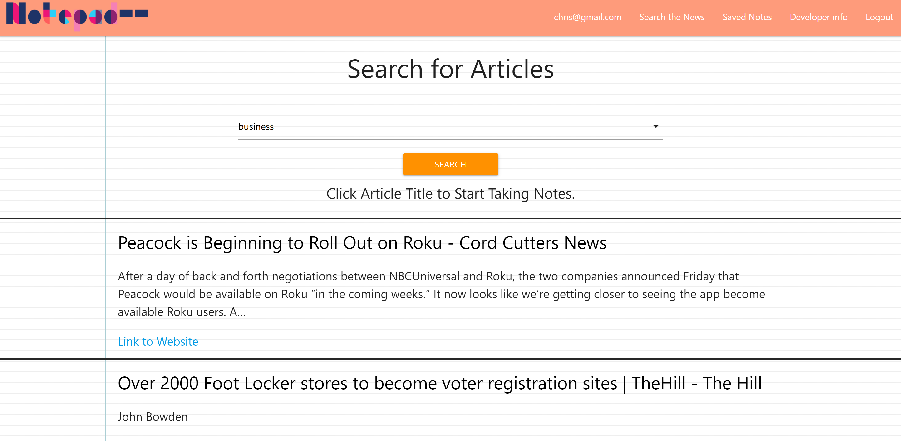

# Notepad --

## Description
The all-in-one resource organizer for students and researchers. Here the user can take look up articles and take notes on them while being able to save it all in one place. No more copying down URLs, just bookmark the page and the notes will be saved with them.

## Motivation
As a student, developer or researcher, I want to have an all-in-one resource manager so that I can stay organized, keep track of helpful articles, and keep track of the notes I took. 

## Usage

### To Test Application use there Credentials (or sign up)
LOGIN: example@notepad.com
PASSWORD: notepad

### Usage
After logging in, the user is directed to the main page, where they can browse previously saved notes. To edit or delete them, they must click on the 
title. The user can also expect to browse current news by clicking on the search button on the navigation bar. Choose from various categories then results will appear. Clicking on a articles title will lead the user to the note-taking page. Because this application is for the purpose of demonstrating value full news content is not avaliable. 

## Preview





## Breakdown of Tasks
Design
 - Gio: About Page, Routes for this page, Design

Authentication
 - Maverick: PassportJS 

Full-Stack
 - Christoper: Sequelize, Font + Back interaction, DOM Manipulation, UI

Back-End
 - Chloe: Back-end, NEWS API

## Technologies Used
 - News API lib
 - Jquery
 - Node.js
 - Express.js & Handlebars
 - three.js
 - Sequelize ORM
 - PassportJS

## Installation
 - npm i

## Database
Sequelize is used throughout this project. While it is not needed, the sequelize cli is very useful for setting up your local development environment:

```bash
npm i -g sequelize-cli
sequelize db:create
```

Sequelize is configured to run from the `config/config.js` which needs the following environment variables set:

```
DB_USERNAME=
DB_PASSWORD=
DB_NAME=
```

## License
MIT 